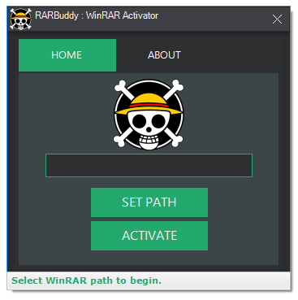

# Descripción
Rar-buddy-wah es un activador simple para el programa WinRAR.

## Características
- Interfaz de usuario intuitiva
- Facilita la activación del programa WinRAR mediante la creación del archivo rarreg.key en el directorio de instalación.

## Tecnologías y dependencias
- [.NET 4.8](https://dotnet.microsoft.com/en-us/download/dotnet-framework/net48)
- [WinForms](https://learn.microsoft.com/en-us/dotnet/desktop/winforms/overview/) (Interfaz)
- [ReaLTaiizor](https://github.com/Taiizor/ReaLTaiizor) (Componentes UI)

## Requisitos
- .NET 4.8
- Windows 7 SP1 en adelante
- WinRAR instalado

## Uso
Puedes dirigirte a la sección de [releases](https://github.com/zNahuelz/rar-buddy-wah/releases) para descargar el archivo ejecutable. Una vez descargado, debes seguir los siguientes pasos:
- Descomprimir el archivo .zip
- Ejecutar el programa como administrador
- Click en "SET PATH"
- Seleccionar la ruta donde se encuentra instalado WinRAR. (Por defecto: C:\Program Files\WinRAR)
- Click en "ACTIVATE"
- ¡Listo!

## Imágenes
Ventana principal del programa

## Advertencia
Programa hecho con fines recreativos y educativos. [Recuerda apoyar al equipo de desarrollo de WinRAR comprando una licencia original.](https://www.win-rar.com/start.html?&L=6) 